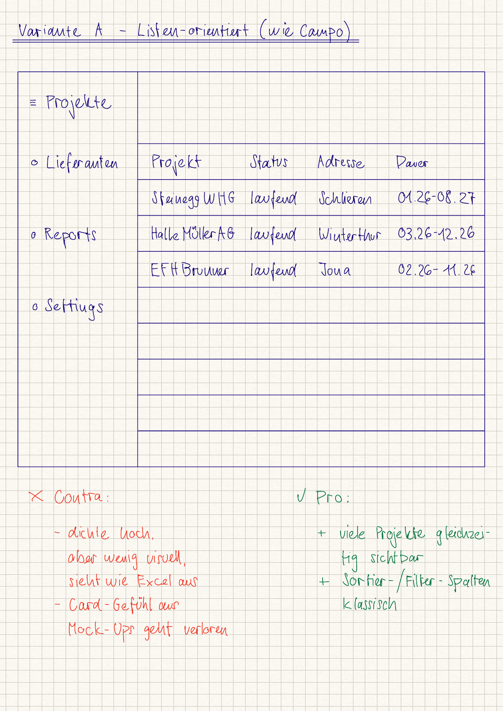
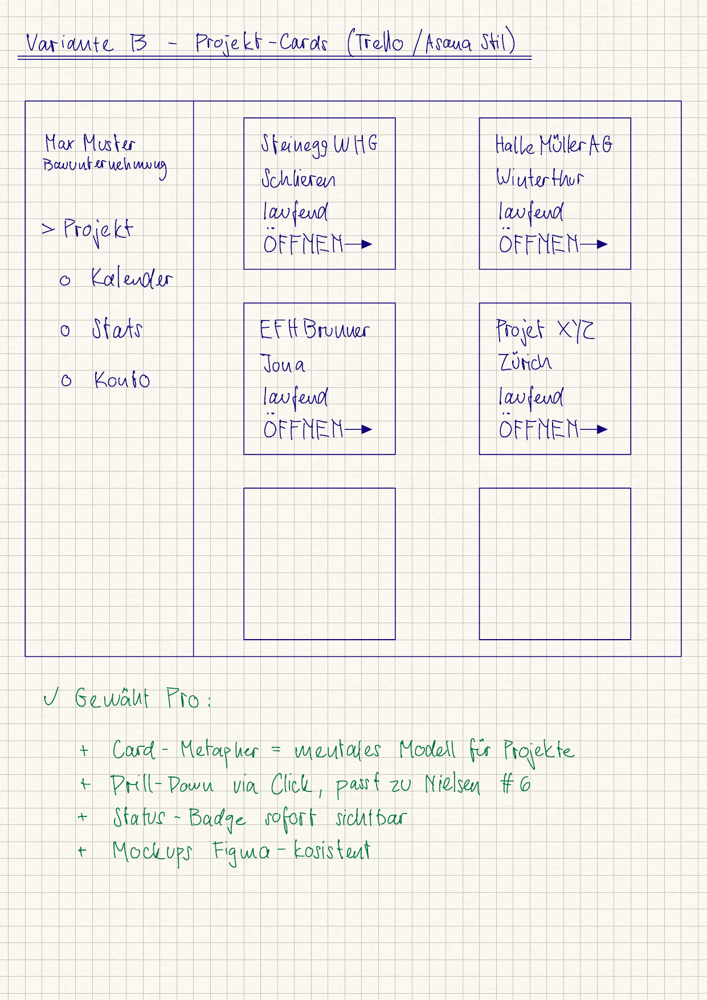
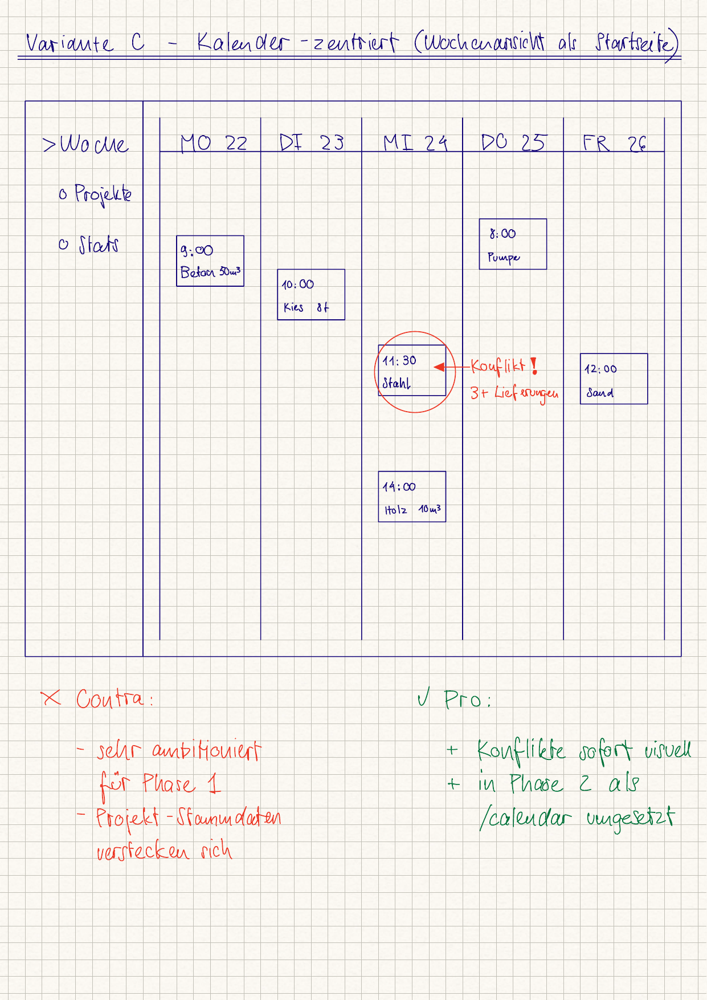
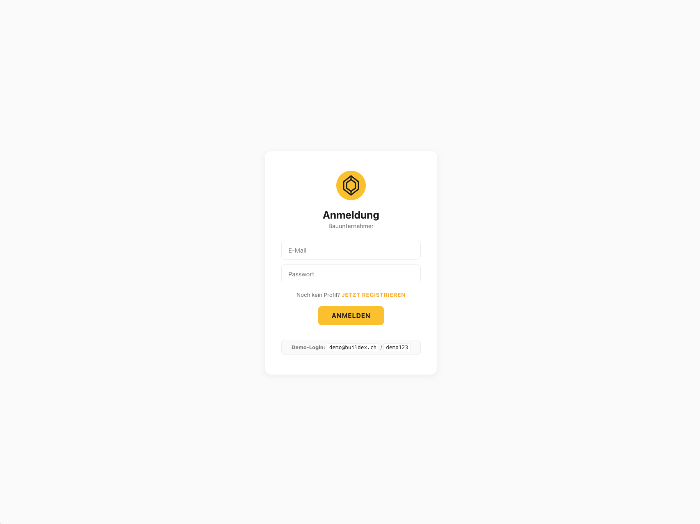
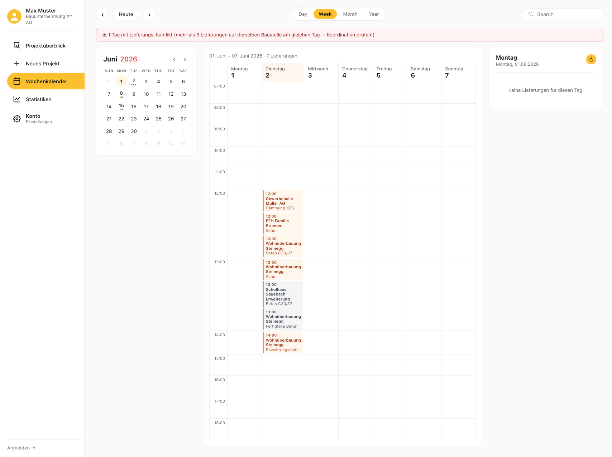
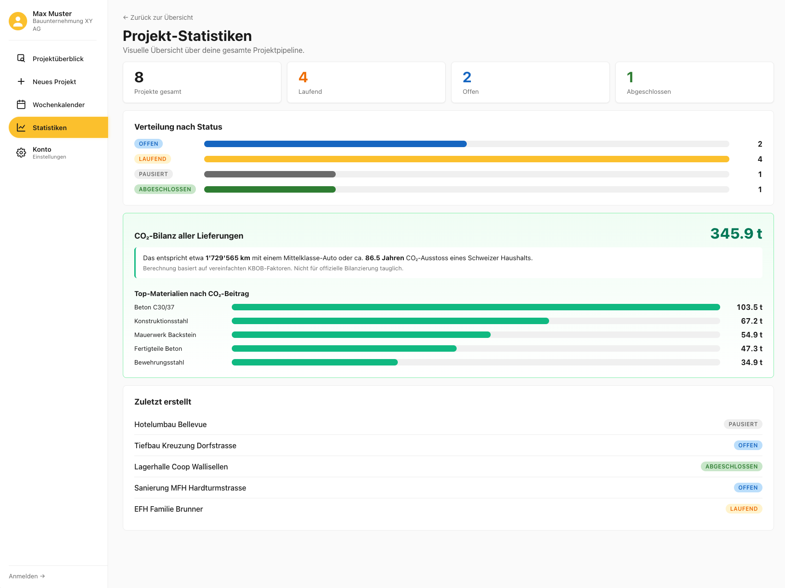
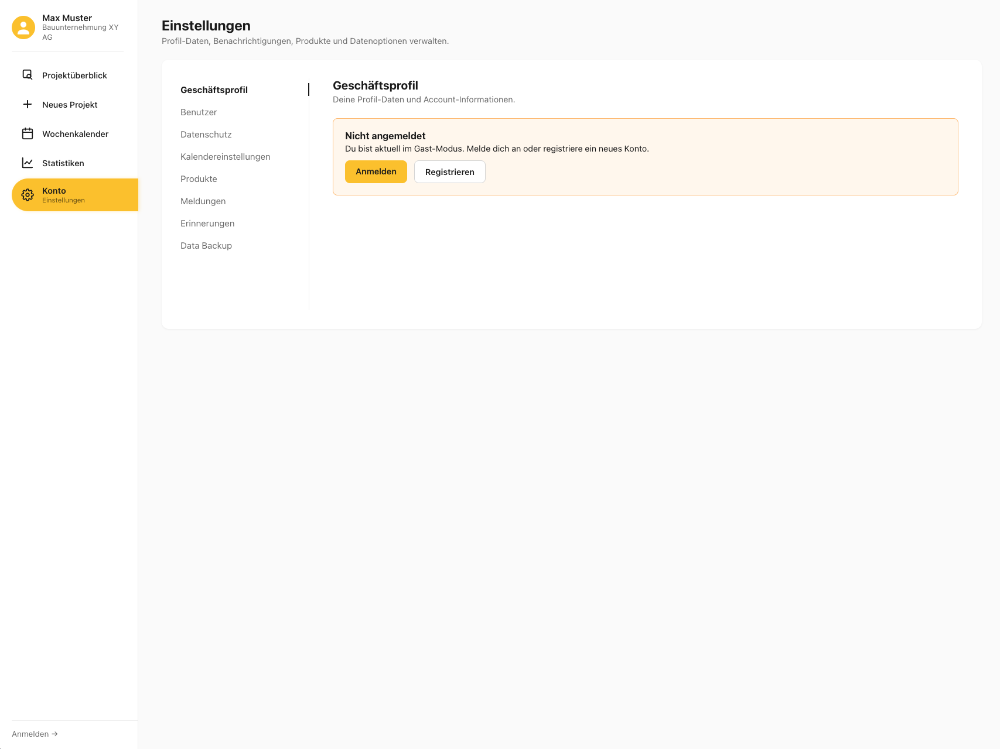

# Projektdokumentation – BUILDEX

> **Live-Demo:** <https://bldx.netlify.app/>
> **Repository:** <https://github.com/Marko-Vukcevic/buildex>
> **Demo-Login:** `demo@buildex.ch` / `demo123`

Digitale Projektverwaltung als Einstieg in den durchgängigen Materialbeschaffungs-Workflow auf Baustellen.

**Autor:** Marko Vukcevic ([vukcema1@students.zhaw.ch](mailto:vukcema1@students.zhaw.ch))
**Modul:** Prototyping (w.BA.XX.3Pt-WIN.XX), ZHAW Wirtschaftsinformatik, FS 2026
**Figma-Mockup:** <https://www.figma.com/design/w0d5idq8xY1KQAPKX1H2Kg/Mock-Up?node-id=0-1&t=bWe691OHcQJzafzs-1>

## Inhaltsverzeichnis

1. [Ausgangslage](#1-ausgangslage)
2. [Lösungsidee](#2-lösungsidee)
3. [Vorgehen & Artefakte](#3-vorgehen--artefakte)
    1. [Understand & Define](#31-understand--define)
    2. [Sketch](#32-sketch)
    3. [Decide](#33-decide)
    4. [Prototype](#34-prototype)
    5. [Validate](#35-validate)
4. [Erweiterungen](#4-erweiterungen)
5. [Projektorganisation](#5-projektorganisation)
6. [KI-Deklaration](#6-ki-deklaration)
7. [Anhang](#7-anhang)

> **Hinweis:** Massgeblich sind die im **Unterricht** und auf **Moodle** kommunizierten Anforderungen.

---

## 1. Ausgangslage

Die Materialbeschaffung auf einer Baustelle läuft heute über fragmentierte, analoge Kanäle: PDF-Bestellungen per E-Mail, WhatsApp-Gruppen für Rückfragen, Excel zur Übersicht und Papier-Lieferscheine im Ordner. Auf einer mittleren Baustelle entstehen pro Woche zehn oder mehr parallele Lieferungen mit dutzenden Bestellungen für Bewehrung, Beton, Kies, Stahlteile oder vorfabrizierte Elemente.

- **Problem:** Es gibt keinen durchgängigen Workflow von der Bestellung über die Liefertermin-Planung bis zum Rechnungsabgleich. Bestellungen werden manuell als PDF erstellt, Lieferscheine gehen im Papierstapel verloren, der Abgleich Bestellung ↔ Lieferung ↔ Rechnung passiert erst Wochen später bei der Rechnungsprüfung. Das ist fehleranfällig und kostet Marge und Termine. Zusätzlich verhindert die rein analoge Datenlage jede strukturierte Auswertung – etwa für CO₂-Reporting auf Projektebene, obwohl die Baubranche rund 11 % des globalen CO₂-Ausstosses verursacht.
- **Ziele:**
  - Bestellungen, Liefertermine, Lieferscheine und Rechnungen pro Bauprojekt **zentral und nachvollziehbar** verwalten.
  - Wareneingang baustellentauglich (mobile, mit Arbeitshandschuhen) in unter 30 Sekunden bestätigen können.
  - Eine strukturierte Datenbasis als Grundlage für Rechnungsabgleich, Reporting und langfristig CO₂-Bilanzen schaffen.
- **Primäre Zielgruppe:** Bauführer und Poliere auf operativer Ebene (mittlere bis grosse Hochbau-Projekte, Projektvolumen CHF 5–50 Mio).
- **Weitere Stakeholder:** Bauleiter / Projektleiter (Kontrolle, Rechnungsfreigabe), Planer / Ingenieure (Bestellungen aus der Planung auslösen), Lieferanten und Subunternehmen (Lieferzusagen, Bestätigungen).

## 2. Lösungsidee

**BUILDEX** ist eine Web-App, die Bestellungen, Liefertermine, Lieferscheine und Rechnungen pro Bauprojekt in einem durchgängigen Workflow zentralisiert. Planer lösen Bestellungen strukturiert aus, Bauführer terminieren in einer Kalenderansicht und bestätigen Wareneingänge mobil in unter 30 Sekunden, Bauleiter prüfen den automatisierten Abgleich Lieferschein ↔ Rechnung in Minuten statt Stunden.

- **Kernfunktionalität (Vision):**
  1. Strukturierte Bestell-Erfassung (Bewehrung, Beton, Fertigteile, …) direkt aus der Planung.
  2. Baustellentaugliche Kalenderansicht aller geplanten Lieferungen pro Projekt – mobile-first, offline-tauglich.
  3. Automatischer Lieferschein-↔-Rechnungs-Abgleich mit stichprobenartiger Freigabe durch den Bauleiter.
  4. Projektübergreifendes Dashboard mit Status-Pipeline (offen / bestätigt / geliefert / verrechnet).
- **Annahmen:** Bauführer akzeptieren eine digitale App nur, wenn die häufigste Aktion (Bestätigen einer Lieferung) in unter 30 Sekunden erledigt ist und auch mit instabilem Netz funktioniert.
- **Abgrenzung für diesen Prototype:**
  - Im Rahmen der Modul-Übungen (Wochen 8–14) wird der **Projekt-Layer** als Fundament gebaut: das digitale Anlegen, Auflisten, Bearbeiten und Auswerten von Bauprojekten. Erst auf dieser Grundlage können in späteren Iterationen die Order-, Liefer- und Rechnungs-Workflows aufgesetzt werden.
  - **Nicht im Scope:** echte Authentisierung (single User), Mobile-Native-App, Offline-Sync, Anbindung an Buchhaltungs- oder CAD-Tools, Multi-Tenant-Logik. Diese Punkte sind klar in die nächsten Iterationen verschoben.

## 3. Vorgehen & Artefakte

Das Projekt folgt dem phasenbasierten Design-Sprint-Vorgehen aus dem Modul.

### 3.1 Understand & Define

- **Zielgruppenverständnis:** Die Beobachtungen aus der praktischen Tätigkeit als Bauführer wurden mit Recherche zu bestehenden Tools (PlanRadar, Capmo, Procore, Comstruct, Nevaris, Bauhub, Sablono) ergänzt. Die Pain Points (Medienbruch bei Bestellungen, fehlende Wochenübersicht auf der Baustelle, manueller Rechnungsabgleich) sind in der Ideenfindungs-Abgabe vollständig dokumentiert (siehe Anhang).
- **Wesentliche Erkenntnisse:**
  - Bestehende Tools sind entweder **zu umfassend** (Procore, Capmo, PlanRadar – grosse SaaS-Plattformen mit Liefer-Tracking nur als Nebenfeature) oder **zu spezialisiert** (Comstruct – Bestellungen ohne Baustellen-Sicht).
  - Es existiert **kein Tool**, das den durchgängigen Workflow Bestellung → Kalender → Lieferschein → Rechnungsabgleich über alle Stakeholder in einem Produkt abbildet.
  - Bedienbarkeit am Handy mit Arbeitshandschuhen und Offline-Fähigkeit sind unterschätzte Kriterien.
- **Drei HMW-Fragen** wurden formuliert und priorisiert. Als **Leitfrage** wurde gewählt: *„Wie könnten wir Bauführern und Polieren eine baustellentaugliche Kalenderansicht geben, die alle eingehenden Lieferungen pro Projekt auf einen Blick zeigt und in unter 30 Sekunden als angekommen bestätigt werden kann?"*

- **Proto-Personas:** Drei repräsentative Personas wurden definiert, um die Anforderungen zu schärfen:

  | Persona | Profil | Goals | Pain Points (Status quo) |
  |---|---|---|---|
  | **Christian Brunner, 42** — Bauführer Marti AG, Region Zürich | 18 Jahre Bauerfahrung, mittlere Grossbaustellen (50-200 Mio CHF), 4 Projekte parallel | Wochenübersicht aller Lieferungen, schnelle Wareneingang-Bestätigung mobil, weniger E-Mail-Chaos | „Ich habe 200 PDFs im Outlook und keinen Plan welche Lieferung welche Woche kommt." |
  | **Sara Iseli, 29** — Junior Bauleiterin Implenia, Vertiefung Hochbau | 3 Jahre nach FH-Abschluss, fokussiert auf Wohnüberbauungen | Strukturierte Daten für Reporting, CO₂-Bilanz pro Projekt, klare Status-Pipeline | „Mein Chef will jeden Freitag ein CO₂-Update — ich rechne das manuell aus Excel zusammen." |
  | **Heinz Vogt, 58** — Polier ARGE-Baustelle Flughafen Zürich Erweiterung | 30 Jahre auf der Baustelle, eher Skeptiker gegenüber digitalen Tools | Sehr wenig Klicks, eindeutige Signale, Bedienung mit Arbeitshandschuhen | „Wenn ich 5 Klicks brauche um eine Lieferung als angekommen zu bestätigen, dann mache ich es nicht." |

  Diese Personas haben drei zentrale Anforderungen geschärft: (1) Wochen-übergreifende Kalenderansicht als Hauptview, (2) Konflikt-Erkennung sichtbar als visueller Hinweis, (3) Status-Wechsel in einem Klick (Dropdown direkt in der Tabelle, kein Detail-Page-Roundtrip).

### 3.2 Sketch

- **Variantenüberblick:** Drei Layout-Varianten wurden auf Papier skizziert: (a) listen-orientiert (Bauakten-Stil wie Capmo), (b) projekt-kartenbasiert (vergleichbar mit Trello/Asana, Drill-Down via Cards), (c) kalender-zentriert (Wochenansicht als Startseite). Die persistente Sidebar-Navigation (Slack-/Notion-Pattern) wurde durchgehend übernommen, weil sie auf Desktop-Auflösungen Standard und für Erweiterungen offen ist.

- **Skizzen:** Die drei Varianten als Hand-Skizzen mit kurzem Pro/Contra-Vermerk:

  
  *Variante A — Listen-orientiert (Capmo-Stil). Verworfen: zu Excel-artig, „Card-Gefühl" aus den Mockups geht verloren.*

  
  *Variante B — Projekt-Cards (Trello/Asana-Stil). **Gewählt** für Phase 1. Card-Metapher passt zum mentalen Modell der Bauleiter, Status-Badge sofort sichtbar, ist Figma-Mockup-konsistent.*

  
  *Variante C — Kalender-zentriert (Wochenansicht als Startseite). Für Phase 1 zu ambitioniert (Projekt-Stammdaten würden sich verstecken), aber das Konflikt-Konzept war stark — in Phase 2 als eigene Route `/calendar` umgesetzt (siehe Kap. 4.6).*
- **Skizzen:** Mehrere Hand-Skizzen pro Variante haben unterschiedliche Ansichten der Dashboard- und Detail-Seiten getestet (siehe Anhang/Repo).

### 3.3 Decide

- **Gewählte Variante & Begründung:** Eine **hybride Lösung** wurde gewählt – Card-basiertes Projekt-Dashboard als Einstieg, persistente Sidebar links, Detail-Page pro Projekt. Die Kalender-Leitfrage wird als nächste Iteration über die Projekt-Detail-Seite aufgesetzt (Lieferungen werden in Phase 2 an ein Projekt gehängt).
- **End-to-End-Ablauf (Stakeholder-übergreifend, aus der A4-Visualisierung):**

  Die ursprüngliche BUILDEX-Vision adressiert **fünf Stakeholder** in einem durchgängigen Material-Beschaffungs-Workflow:

  ```mermaid
  flowchart LR
      A[Bauherr / Planer<br/>Architekt, Fachplaner] -->|Bestellung digital erfassen<br/>z.B. Eisenliste hochladen| B[Bauunternehmen<br/>Bauführer / Polier]
      B -->|Liefertermin festlegen<br/>+ Freigabe| C[Lieferant /<br/>Subunternehmer]
      C -->|Anlieferung +<br/>digitaler Lieferschein| D[Bauführer<br/>auf Baustelle]
      D -->|Wareneingang bestätigen<br/>+ Ausmass erstellen| E[Bauleitung<br/>Rechnungs-Freigabe]
      E -->|Stichproben-Kontrolle<br/>+ Freigabe für Buchhaltung| F((Rechnung<br/>verrechnet))
      style A fill:#fef3c7,stroke:#b45309
      style B fill:#fef3c7,stroke:#b45309
      style D fill:#fef3c7,stroke:#b45309
      style E fill:#fef3c7,stroke:#b45309
      style F fill:#86efac,stroke:#047857
  ```

  **Scope für diesen Prototyp:** Die Schritte 2–4 (Bauunternehmen → Lieferant → Bauführer) werden vollständig digital abgebildet: Bauführer legt Bauprojekte und Lieferungen an, terminiert sie im Kalender, bestätigt den Status-Wechsel (bestellt → bestätigt → unterwegs → angekommen → verrechnet) und führt eine Notizen-Timeline als digitales Bautagebuch. Schritte 1 (Bauherr-Auftrag) und 5 (Rechnungs-Workflow) sind im Mockup angedeutet und für Phase 2 vorgesehen.

- **End-to-End-Ablauf im Prototyp (konkret im Code umgesetzt):**
  1. Bauleiter loggt sich ein (Demo-Login mit Cookie-Session).
  2. Sieht **Projektübersicht** mit allen Baustellen als Cards + KPI-Kacheln.
  3. Klick auf "+ Neues Projekt" → Formular → Projekt in MongoDB persistiert.
  4. Klick auf Card → Detail-Seite mit Stammdaten, KPI-Kacheln, Lieferungs-Tabelle, Notizen-Timeline.
  5. "+ Neue Lieferung" → Material-Picker mit Auto-Einheit → speichert in `deliveries`-Collection mit berechneter CO₂-Bilanz.
  6. Sidebar → Wochenkalender → alle Lieferungen über alle Projekte, Konflikt-Banner bei >3 Lieferungen/Tag/Baustelle.
  7. Sidebar → Statistiken → Globale CO₂-Bilanz mit Top-5-Materialien-Ranking.

- **Mockup:** Interaktives Figma-Mockup mit Login, Dashboard, Settings, Projektansicht und Kalender → <https://www.figma.com/design/w0d5idq8xY1KQAPKX1H2Kg/Mock-Up?node-id=0-1&t=bWe691OHcQJzafzs-1> (View-Zugriff für alle mit Link). Der Prototyp baut visuell und konzeptionell auf diesem Mockup auf. Zusätzlich liegt eine *A4-Visualisierung* mit User-Flow, USP und 5 Mock-Up-Screenshots als PDF im Repo unter `/docs/A4-Visualisierung_BUILDEX.pdf`.

### 3.4 Prototype

#### 3.4.1 Entwurf (Design)

- **Informationsarchitektur:** Vier Top-Level-Routen, alle mit derselben Sidebar:
  - `/` – **Projektüberblick**: Stats-Kacheln, Filter (Such-Feld + Status-Dropdown), Card-Grid.
  - `/projects/new` – **Erfassungs-Formular** mit Validierung.
  - `/projects/[id]` – **Detail-Page** mit Inline-Edit und Delete-Confirm.
  - `/stats` – **Statistik-Page** mit Balken-Charts pro Status und Liste der zuletzt erstellten Projekte.
  - `/account` – **Konto-Settings** (statischer Mockup-Platzhalter aus Phase-2-Scope).
- **User Interface Design:** Übernommen vom Figma-Mockup:
  - Linke schmale Sidebar mit gelbem B-Logo, User-Name, vier Nav-Items mit Icons. Aktive Route ist gelb hervorgehoben.
  - Card-Grid in der Mitte, weisse Cards auf grauem Hintergrund, gelber Akzent als Status-Badge und Hover-Indikator.
  - Konsistente Typografie (Inter / System-Sans), abgestimmtes Spacing über CSS-Variablen in `src/app.css`.
- **Designentscheidungen:**
  - **Zielsystem Desktop (nicht Mobile).** Begründung: primäre Persona arbeitet im Baucontainer/Hauptsitz an einem MacBook; mehrere Projekte parallel zu verwalten ist auf 6"-Display nicht zumutbar. Mobile-Companion-App ist für Phase 3 geplant.
  - **Projekt-zentrisches Modell.** Begründung: Im mentalen Modell eines Bauleiters dreht sich alles um Projekte (Baustellen). Card-Metapher (vgl. Trello/Asana) ist branchenüblich und ermöglicht Drill-Down (Nielsen-Heuristik #6 *Recognition over Recall*).
  - **Persistente Sidebar.** Begründung: *Consistency & standards* (Nielsen #4) – Hauptnavigation bleibt überall an gleicher Position; Erweiterungen ohne Layout-Bruch möglich.
  - **Gelb als Akzentfarbe.** Begründung: Branchen-Konnotation (Helme, Warnwesten, Markierungen) und Differenzierung gegen blau/grün-dominierte SaaS-Tools wie Procore.
  - **Mehrere Status-Badges (offen/laufend/pausiert/abgeschlossen).** Begründung: schnelle visuelle Erfassung des Projekt-Zustands ohne Drill-Down (*Visibility of system status*, Nielsen #1).

- **Screenshots der wichtigsten Workflows** (Live-Stand https://bldx.netlify.app/, Mai 2026):

  
  *Anmelde-Seite: Demo-Login (`demo@buildex.ch` / `demo123`) ist sichtbar dokumentiert, damit Dozierende ohne Konto einsteigen können. Login-Card mit BUILDEX-Diamant-Logo im gelben Kreis, „Bauunternehmer"-Subtitel und „JETZT REGISTRIEREN"-Link in Bau-Gelb (Iteration aus Eval-Issue 3.5.1, siehe Kap. 4.9).*

  
  *Projektüberblick: Sidebar weiss mit gelber Aktiv-Pille, KPI-Streifen (Total/Laufend/Offen/Abgeschlossen), Suchleiste mit gelbem Lupe-Icon und Status-Dropdown oben, „+ Neues Projekt" rechts. 8 Projekt-Cards im Mockup-Stil mit Status-Badge, Adresse, Projektdauer und „ÖFFNEN" in Material-Blau.*

  
  *Projekt-Detail-Page (Wohnüberbauung Steinegg): Title + „Baustelle:"-Subtitle, vier KPI-Kacheln (Lieferungen total / Überfällig / Unterwegs+bestätigt / **CO₂-Bilanz 93.4 t**), Sub-Tab-Navigation (Bestellungseingänge / Notizen-Verlauf / Stammdaten), Tabelle mit Status-Pillen (grau verrechnet, blau unterwegs, orange bestätigt) und Document-Icons. Rechts oben die gelbe Filter/Edit-Pille (Toggle in den Bearbeiten-Modus).*

  
  *Wochenkalender: Top-Bar mit `‹ Heute ›`-Pille und Day/Week/Month/Year-Tabs (Week aktiv gelb). Links Mini-Kalender mit farbigen Punkten unter Tagen, die die Anzahl Lieferungen anzeigen. Mitte: Wochen-Grid mit Stunden 07:00–18:00 und farbcodierten Lieferungs-Karten pro Status. Oben das **Konflikt-Banner** „⚠ 1 Tag mit Lieferungs-Konflikt": am Di 02.06. sind 4 Lieferungen auf der Baustelle Wohnüberbauung Steinegg geplant — die Konflikt-Detection markiert den Tag orange und warnt vor Koordinationsproblemen, bevor sie zu Verzögerungen führen.*

  
  *Statistik-Page: Vier KPI-Kacheln (Projekte gesamt, Laufend, Offen, Abgeschlossen), Status-Verteilung als horizontale Balken-Charts, und die grüne **CO₂-Bilanz-Sektion** mit dem Gesamtwert 345.9 t — übersetzt in eine lebensweltliche Vergleichszahl: ~1'729'565 Auto-Kilometer oder ~86.5 Jahre eines Schweizer Haushalts. Darunter Top-5-Materialien nach CO₂-Beitrag (Beton C30/37 dominiert mit 103.5 t). Quelle: vereinfachte KBOB-Faktoren.*

  
  *Konto-Einstellungen: Zweispaltiges Layout (links Sub-Navigation mit 8 Tabs: Geschäftsprofil, Benutzer, Datenschutz, Kalendereinstellungen, Produkte, Meldungen, Erinnerungen, Data Backup), rechts der Content. Aktiver Sub-Tab wird mit fettem schwarzem Text und einem vertikalen Strich rechts markiert (1:1 wie Figma-Mockup). Im Bild der Gast-Modus-Hinweis mit „Anmelden"- und „Registrieren"-CTAs, falls man nicht eingeloggt ist.*

#### 3.4.2 Umsetzung (Technik)

- **Technologie-Stack:**
  - **Framework:** SvelteKit 2 mit Svelte 5 (Runes-Modus aktiv), `@sveltejs/adapter-auto`.
  - **Sprache:** JavaScript (kein TypeScript – bewusst gewählt für klaren Lernfokus auf SvelteKit-Grundlagen).
  - **Datenbank:** MongoDB Atlas (M0 Free Tier, AWS Frankfurt). Anbindung über den offiziellen `mongodb`-Treiber.
  - **Hosting:** Netlify (mit `@sveltejs/adapter-auto` automatische Detection und SvelteKit-Build).
  - **Style:** Reines CSS mit Custom Properties (Tokens in `src/app.css`) – kein externes UI-Framework, um den Code-Umfang im Lehrkontext überschaubar zu halten.
- **Tooling:** Visual Studio Code mit Svelte-Extension, GitHub Desktop / CLI für Versionierung, MongoDB Atlas Web-UI für DB-Inspektion, Figma für Mockups. Der KI-Einsatz ist im Kapitel **KI-Deklaration** dokumentiert.
- **Struktur & Komponenten:**
  ```text
  src/
  ├── app.css                                  ← globale Design-Tokens
  ├── lib/
  │   ├── components/
  │   │   ├── Sidebar.svelte                   ← persistente Navigation
  │   │   └── ProjectCard.svelte               ← Card im Grid
  │   └── server/
  │       ├── db.js                            ← MongoDB-Connection (Singleton)
  │       └── projects.js                      ← CRUD + Validierung + Statistik
  └── routes/
      ├── +layout.svelte                       ← App-Skelett (Sidebar + Content)
      ├── +page.svelte                         ← Dashboard
      ├── +page.server.js                      ← Liste + Filter laden
      ├── projects/
      │   ├── new/+page.svelte
      │   ├── new/+page.server.js              ← Form-Action: Create
      │   ├── [id]/+page.svelte
      │   └── [id]/+page.server.js             ← Form-Actions: Update + Delete
      ├── stats/+page.svelte
      ├── stats/+page.server.js
      └── account/+page.svelte
  ```
  - Zentrale Validierung in `src/lib/server/projects.js` (Pflichtfeld `name`, Maxlängen, Status-Whitelist, Datums-Plausibilität).
  - Server-only Code (DB-Connection, Passwort, Validierung) ist konsequent unter `src/lib/server/` abgelegt – SvelteKit bundelt diese Dateien niemals in den Client-Build.
- **Daten & Schnittstellen:**
  - Datenmodell `projects`:
    ```js
    {
      _id: ObjectId,
      name: string,                         // Pflicht, max 100
      address: string,                      // optional, max 200
      startDate: string,                    // "YYYY-MM"
      endDate: string,                      // "YYYY-MM"
      status: 'offen' | 'laufend' | 'pausiert' | 'abgeschlossen',
      notes: string,                        // optional, max 2000
      createdAt: Date,
      updatedAt: Date
    }
    ```
  - Server-Loads (`+page.server.js`) lesen via `getProjectsCollection()`, Form-Actions schreiben.
  - Query-Parameter steuern Filter (`/?search=...&status=...`).
- **Datenmodell – ER-Diagramm (5 Collections in MongoDB):**

  ```mermaid
  erDiagram
      USER ||--o{ NOTE : "schreibt (author)"
      PROJECT ||--o{ DELIVERY : "hat"
      PROJECT ||--o{ NOTE : "hat"
      MATERIAL ||--o{ DELIVERY : "wird verwendet in"
      USER {
          ObjectId _id
          string email "unique"
          string username "unique"
          string passwordHash
          string salt
          string company
          string role "z.B. Bauführer, Bauleiter"
          Date createdAt
      }
      PROJECT {
          ObjectId _id
          string name
          string address
          string startDate "YYYY-MM"
          string endDate "YYYY-MM"
          string status "offen|laufend|pausiert|abgeschlossen"
          string notes
          Date createdAt
          Date updatedAt
      }
      DELIVERY {
          ObjectId _id
          string projectId "FK to PROJECT"
          string material "denormalized name"
          string materialKey "FK to MATERIAL.key"
          number quantity
          string unit "m³|t|Stk"
          string supplier
          string scheduledDate "YYYY-MM-DD"
          string status "bestellt|bestaetigt|unterwegs|angekommen|verrechnet"
          number co2Kg "computed at write"
          Date createdAt
          Date updatedAt
      }
      NOTE {
          ObjectId _id
          string projectId "FK to PROJECT"
          string text "max 1000 chars"
          string author "User.username or 'Max Muster'"
          Date createdAt
      }
      MATERIAL {
          ObjectId _id
          string key "unique, e.g. beton_c30"
          string name "Anzeige-Name"
          string unit
          number co2PerUnit "kg CO₂ / unit (KBOB)"
      }
  ```

  Designentscheidungen am Datenmodell:
  - **Denormalisierung von `co2Kg` in DELIVERY** statt Live-Berechnung — ermöglicht effiziente Aggregations-Queries auf der Stats-Seite ohne Join.
  - **Material-Referenz als String-Key** (`materialKey`), nicht als ObjectId-Foreign-Key — vereinfacht Imports und macht das Schema lesbarer.
  - **`author` als denormalisierter Username-String in NOTE** — Bautagebuch-Charakter: Notiz behält den damaligen Username auch wenn der User später umbenannt/gelöscht wird.
- **Deployment:** Auf Netlify deployed. Build-Befehl `npm run build`. Environment Variable `MONGODB_URI` ist im Netlify-Dashboard hinterlegt (nicht im Repo).
  - **Live-URL:** *Wird nach Netlify-Deploy ergänzt.*
- **Besondere Entscheidungen / Trade-offs:**
  - **Kein TypeScript** – Lehrkontext, schnellere Iteration. Validierung kompensiert die fehlende statische Typprüfung.
  - **MongoDB statt SQL** – passt zum Modul-Kontext (Data Management deckt MongoDB ab) und liefert flexible Erweiterbarkeit für die kommenden Order/Delivery-Subdokumente.
  - **Kein Auth im ersten Wurf, später nachgerüstet** – ursprünglich war Auth bewusst out-of-scope (Fokus auf CRUD); nach der Usability-Evaluation am 20.05.2026 wurde das Issue *„Anmeldeprozess fehlt"* aufgenommen und ein Demo-Auth-System nachgebaut (siehe Kap. 4.9).
  - **Explizit `@sveltejs/adapter-netlify` statt `adapter-auto`** – `adapter-auto` produzierte beim Netlify-Build ein leeres Publish-Verzeichnis, was zu einem 404 auf der deployten App führte. Erst der explizite Netlify-Adapter mit `netlify.toml` löste das Deployment-Problem.

### 3.5 Validate

**URL der getesteten Version:** <https://bldx.netlify.app/> (getestet am 20.05.2026, commit `df73b12` — Stand vor der Auth-Nachrüstung in Kap. 4.9; alle anderen Workflows entsprechen dem aktuellen Stand).

**Ziele der Prüfung:**
- Können neue Nutzende ohne Anleitung ein Projekt erfassen und eine Lieferung dazu hinzufügen?
- Verstehen sie das Konzept der Wochenkalender-Ansicht und erkennen sie Lieferungs-Konflikte?
- Sind die Begriffe (Status-Bezeichnungen, „CO₂-Bilanz", „überfällig") für das mentale Modell verständlich?
- Welche Workflows fehlen aus Nutzer-Sicht, die für die Akzeptanz als Bauleitungs-Tool zentral wären?

**Vorgehen:** Moderierte On-Site-Usability-Evaluation am **20.05.2026** im Rahmen des Pflichttermins der Kleinklasse (Raum SW 324). Thinking-Aloud-Methode mit Feedback-Grid-Protokollierung pro Testperson, anschliessend gemeinsame Diskussion zur Konsolidierung. Testskript und Notizen siehe Kap. 7 (Anhang).

**Stichprobe:** 2 Testpersonen — beide Mitstudierende aus der Kleinklasse:

| # | Name | E-Mail | Profil |
|---|---|---|---|
| 1 | Aladin Kermo | kermoala@students.zhaw.ch | Wirtschaftsinformatik-Student, keine Bauerfahrung |
| 2 | Patrick Ferreira | ferrepa1@students.zhaw.ch | Wirtschaftsinformatik-Student, keine Bauerfahrung |

> **Profil-Lücke (transparent dokumentiert):** Das Profil der Tester entspricht *nicht* der primären Zielgruppe (Bauführer/Bauleiter). Die Ergebnisse zeigen daher vor allem Usability-Aspekte aus *Laien-Sicht* (Lesbarkeit, Affordances, Begriffsverständnis). Domänen-spezifische Erkenntnisse (z. B. ob die Lieferungs-Status-Pipeline einem echten Bauwerkflow entspricht) werden in einer Folge-Iteration mit Bauleiter-Probanden geprüft.
>
> **Reziprozität:** Im Rahmen desselben Pflichttermins habe ich umgekehrt das Projekt **StudyStreak** von Valdrin Dalipi getestet (siehe Cross-Reference im Anhang).

**Aufgaben/Szenarien:**

> *Ausgangslage:* Sie arbeiten in einem Bauunternehmen und sollen die Materiallieferungen für mehrere parallele Bauprojekte koordinieren.

**Aufgabe 1:** Verschaffen Sie sich einen Überblick über die aktuellen Baustellen.
*Erfolgskriterium: Dashboard wird gefunden, Cards werden interpretiert.*

**Aufgabe 2:** Sehen Sie nach, welche Materiallieferungen diese und nächste Woche eingehen.
*Erfolgskriterium: Wochenkalender wird gefunden und navigiert.*

**Aufgabe 3:** Legen Sie ein neues Bauprojekt an mit Name, Adresse und Status.
*Erfolgskriterium: Projekt erscheint auf dem Dashboard.*

**Aufgabe 4:** Bestellen Sie für ein bestehendes Projekt eine zusätzliche Materiallieferung.
*Erfolgskriterium: Neue Lieferung erscheint in der Lieferungs-Tabelle, CO₂-Kachel aktualisiert sich.*

**Aufgabe 5:** Legen Sie ein neues Bauleiter-Konto an, damit Sie selber damit arbeiten können.
*Erfolgskriterium: Registrierungs-Workflow wird gefunden und durchgespielt. Bewusst gestellt, obwohl Auth zu diesem Zeitpunkt noch nicht implementiert war — um die Reaktion zu beobachten.*

**Kennzahlen & Beobachtungen:**

| Task | Aladin | Patrick | Beobachtung |
|---|---|---|---|
| T1 – Projektüberblick | ✅ abgeschlossen | ✅ abgeschlossen | Card-Layout sofort verstanden, Filter/Suche werden intuitiv genutzt. |
| T2 – Wochenkalender | ✅ abgeschlossen | ✅ abgeschlossen | Sidebar-Navigation klar, Konflikt-Banner wird positiv erwähnt. |
| T3 – Neues Projekt | ✅ abgeschlossen | ✅ abgeschlossen | Formular läuft sauber durch, Validierungs-Feedback ist hilfreich. |
| T4 – Neue Lieferung | ⚠️ abgeschlossen mit Umweg | ⚠️ abgeschlossen mit Umweg | Status-Wechsel-Dropdown direkt in der Tabelle wird nicht sofort als interaktiv erkannt. „Bearbeiten"-Button auf Detail-Page wird auf den ersten Blick übersehen. |
| T5 – Konto anlegen | ❌ nicht durchführbar | ❌ nicht durchführbar | Beide Tester suchen aktiv nach Login/Register, finden nichts. Konsens-Feedback: „Anmeldeprozess fehlt komplett." |

⚠️ = abgeschlossen mit merklicher Verzögerung oder Umweg · ❌ = nicht abschliessbar

**Feedback-Grid – Aladin Kermo:**

| ✅ Was hat gut funktioniert / gefallen | ❌ Was hat nicht funktioniert / gestört |
|---|---|
| Projektüberblick auf dem Dashboard wird sofort intuitiv navigiert | Anmeldeprozess fehlt komplett |
| Wochenkalender-Navigation und farblich kodierte Status sind klar | Status-Wechsel in Lieferungs-Tabelle nicht als interaktiv erkannt |
| Darstellung und Nutzbarkeit sauber und übersichtlich (gelb-weiss-Schema) | „Bearbeiten"-Button auf Detail-Page wird übersehen |

| 💡 Neue Ideen / Anforderungen | ❓ Was war unklar |
|---|---|
| Anmelde-/Registrierungs-Prozess einbauen für Mehr-Nutzer-Szenarien | Wo schaltet man Status der Lieferung um? |

**Feedback-Grid – Patrick Ferreira:**

| ✅ Was hat gut funktioniert / gefallen | ❌ Was hat nicht funktioniert / gestört |
|---|---|
| CO₂-Bilanz pro Projekt mit Auto-km-Vergleich macht das Thema greifbar | Anmelde-/Login-Funktion fehlt — wirkt unvollständig |
| Konflikt-Banner im Wochenkalender ist eine starke visuelle Warnung | Sub-Tabs auf der Detail-Seite (Stammdaten/Notizen/Bestellungseingänge) waren nicht sofort als Tabs sichtbar |
| Status-Pillen in Farbe geben sofortige Orientierung | Doc-Icon in Lieferungs-Tabelle nicht selbsterklärend (was passiert beim Klick?) |

| 💡 Neue Ideen / Anforderungen | ❓ Was war unklar |
|---|---|
| Multi-User mit Rollen (Bauherr vs. Bauleiter vs. Lieferant) | Unterschied zwischen „bestellt", „bestätigt" und „unterwegs" — eine Pipeline-Visualisierung wäre hilfreich |
| Beim Speichern einer Lieferung kurzer „Erfolg"-Toast statt nur Page-Reload | – |

**Issue Map (Severity-Skala 0–4 nach Nielsen):**

| Issue-ID | Beschreibung | Schweregrad | Häufigkeit |
|---|---|---|---|
| **3.5.1** | Anmeldeprozess fehlt (keine Login/Register/Logout-Funktion) | **3 — Gross** | beide Tester (Konsens-Issue) |
| 3.5.2 | Status-Wechsel-Dropdown in Lieferungs-Tabelle wird nicht sofort als interaktiv erkannt | 2 — Klein | beide Tester |
| 3.5.3 | „Bearbeiten"-Button auf Detail-Seite wird auf den ersten Blick übersehen | 2 — Klein | Aladin |
| 3.5.4 | Sub-Tabs auf Detail-Seite (Bestellungseingänge / Notizen / Stammdaten) nicht sofort als Tabs erkennbar | 1 — Kosmetisch | Patrick |
| 3.5.5 | Doc-Icon in Lieferungs-Tabelle nicht selbsterklärend (was passiert beim Klick?) | 1 — Kosmetisch | Patrick |

**Zusammenfassung der Resultate:** Die zentrale Such-/Browse-Funktionalität (Dashboard, Kalender, Stats) wird von beiden Testern intuitiv bedient. Die grösste konsistent identifizierte Lücke ist der **fehlende Anmeldeprozess** — beide Tester suchen aktiv danach und können Aufgabe 5 nicht ausführen (Konsens-Issue). Kleinere Affordance-Schwächen (Status-Dropdown, Bearbeiten-Button, Sub-Tabs, Doc-Icon) sind in Folge-Iterationen zu beheben. Eine breitere Test-Runde mit der primären Zielgruppe (Bauleiter aus der Praxis) würde domänen-spezifische Erkenntnisse ergänzen.

**Abgeleitete Verbesserungen (Priorisierung):**

| Priorität | Massnahme | Status | Begründung |
|---|---|---|---|
| **Hoch** | Auth-System implementieren (Login/Register/Logout, Cookie-Session, User-Verwaltung) | ✅ umgesetzt in [Erweiterung 4.9](#49-auth-system-demo-login--registrierung--logout-iteration-aus-evaluation), [Issue mit Bezug zu Eval 3.5.1] | T5: Konsens beider Tester, blockiert die wahrgenommene Vollständigkeit |
| **Mittel** | Status-Wechsel-Dropdown visuell als interaktiv markieren (Hover, Chevron-Icon) | 📋 [GitHub Issue #4](https://github.com/Marko-Vukcevic/buildex/issues/4) — Phase 2 | T4: beide Tester übersahen die Interaktivität |
| **Mittel** | „Bearbeiten"-Button auf Detail-Page visuell betonen | 📋 [GitHub Issue #5](https://github.com/Marko-Vukcevic/buildex/issues/5) — Phase 2 | T4: Aladin scrollte unnötig |
| **Gering** | Sub-Tabs auf Detail-Page deutlicher als Tabs markieren | 📋 Backlog | Patrick: kosmetisch |
| **Gering** | Doc-Icon in Tabelle mit Tooltip oder Beschriftung versehen | 📋 Backlog | Patrick: kosmetisch |
| **Gering** | Erfolgs-Toast nach Speichern einer Lieferung | 📋 Backlog | Patrick: UX-Detail |

Weitere Backlog-Kandidaten (aus Selbst-Review, nicht aus Evaluation): Bauherr-Feld, Drag-and-Drop-Status-Wechsel, Inline-Edit direkt in der Card, Pipeline-Visualisierung der Status-Schritte.

## 4. Erweiterungen

> Über den Mindestumfang (Projekt-CRUD) hinaus wurden **neun Erweiterungen** umgesetzt — vier davon ergänzen den ursprünglichen Scope (Detail-Page, Filter, Stats, Validierung), vier weitere realisieren die in der Ideenfindung beschriebene Kern-Vision (Lieferungen, Wochenkalender, CO₂-Bilanz, Notizen-Timeline), und eine wurde **direkt aus der Usability-Evaluation abgeleitet** (Auth-System). Damit wird BUILDEX vom generischen Projekt-CRUD zu einem fachspezifischen Bauleitungs-Tool mit Multi-User-Fähigkeit.

### 4.1 Projekt-Detail-Seite mit Inline-Edit und Delete-Confirm
- **Beschreibung & Nutzen:** Eigene Route `/projects/[id]` mit vollständigen Stammdaten, Notizen, Erstellungs-/Änderungs-Zeitstempel. Edit-Modus passiert inline auf derselben Seite (keine zusätzliche Navigation). Löschen erfordert eine native `confirm()`-Bestätigung (*Error prevention*, Nielsen #5).
- **Wo umgesetzt:**
  - Frontend: `src/routes/projects/[id]/+page.svelte` (Edit-Toggle mit `$state`).
  - Backend: `src/routes/projects/[id]/+page.server.js` (Form-Actions `update` und `delete`).
  - Datenbank: `updateProject(id, data)` und `deleteProject(id)` in `src/lib/server/projects.js`.
- **Referenz:** Beschreibung in Kap. 3.4.

### 4.2 Filter & Such-Funktion auf dem Dashboard
- **Beschreibung & Nutzen:** Bauleiter mit vielen parallelen Projekten können nach freiem Text (Name oder Adresse) und nach Status filtern. Query-Parameter (`?search=...&status=...`) machen den Filter-Zustand teilbar und bookmarkbar.
- **Wo umgesetzt:**
  - Frontend: `<form method="GET">` in `src/routes/+page.svelte` mit `data-sveltekit-keepfocus`.
  - Backend: `listProjects({ search, status })` in `src/lib/server/projects.js` baut die MongoDB-Query dynamisch (case-insensitive Regex, Status-Match).
- **Referenz:** Sichtbar auf der Startseite über dem Card-Grid.

### 4.3 Statistik-Page mit Balken-Charts
- **Beschreibung & Nutzen:** Eigene Route `/stats` mit KPI-Kacheln (Total, Laufend, Offen, Abgeschlossen), Balken-Visualisierung der Status-Verteilung und Liste der zuletzt erstellten Projekte. Bietet Management-Übersicht ohne Drill-Down.
- **Wo umgesetzt:**
  - Aggregation: `projectStats()` in `src/lib/server/projects.js` (MongoDB `$group`-Aggregation).
  - Frontend: `src/routes/stats/+page.svelte` mit reinen CSS-Balken (kein Chart-Library nötig).
- **Referenz:** Linker Sidebar → "Statistiken".

### 4.4 Zentralisierte Validierung mit Fehler-Feedback
- **Beschreibung & Nutzen:** Alle Form-Inputs werden serverseitig in `src/lib/server/projects.js` validiert (Pflicht-Feld, Maxlängen, Status-Whitelist, Plausibilität von Start/Ende). Bei Fehlern bleibt der Formular-Inhalt erhalten und Inline-Fehlermeldungen erscheinen unter dem betroffenen Feld (*Help users recognize, diagnose, and recover from errors*, Nielsen #9).
- **Wo umgesetzt:**
  - Validierungs-Funktion: `validate(data)` in `src/lib/server/projects.js`.
  - Frontend: `{#if form?.errors?.name}<small class="err">…</small>{/if}` in beiden Formular-Pages.

### 4.5 Lieferungen pro Projekt (Sub-Entity CRUD mit Status-Workflow)
- **Beschreibung & Nutzen:** Pro Projekt können Material-Lieferungen (Beton, Stahl, Holz, Fertigteile etc.) erfasst, terminiert und durch einen 5-stufigen Status-Workflow gezogen werden: **bestellt → bestätigt → unterwegs → angekommen → verrechnet**. Damit wird das in der Ideenfindung beschriebene Kern-Problem ("kein durchgängiger Workflow Bestellung → Liefertermin → Lieferschein → Rechnung") direkt adressiert. Lieferungen mit Liefertermin in der Vergangenheit, die nicht als angekommen markiert sind, werden als *überfällig* rot hervorgehoben (Nielsen #1: *Visibility of system status*). Der Status kann direkt in der Tabelle per Dropdown gewechselt werden (kein Detail-Seiten-Roundtrip).
- **Wo umgesetzt:**
  - **Frontend:** `/projects/[id]/+page.svelte` (Lieferungs-Tabelle mit Inline-Status-Switcher), `/projects/[id]/deliveries/new/+page.svelte` (Neuanlage mit Material-Picker der die Einheit automatisch vorausfüllt), `/projects/[id]/deliveries/[did]/+page.svelte` (Edit/Delete via `formaction`-Buttons).
  - **Backend:** `src/lib/server/deliveries.js` mit `createDelivery`, `updateDelivery`, `setDeliveryStatus`, `deleteDelivery`, `listDeliveriesForProject`, `deliverySummaryForProject` (Anzahl/Überfällig-Count/CO₂-Total). Form Actions: `addDelivery`, `setDeliveryStatus`, `deleteDelivery` auf der Projekt-Detail-Seite.
  - **Datenbank:** Neue Collection `deliveries` (Felder: projectId, material, materialKey, quantity, unit, supplier, scheduledDate, status, notes, co2Kg, createdAt, updatedAt).
- **Referenz:** Sichtbar auf jeder Projekt-Detail-Seite unterhalb der KPI-Kacheln.

### 4.6 Wochenkalender mit Konflikt-Erkennung
- **Beschreibung & Nutzen:** Eigene Route `/calendar` zeigt eine **Montag-Sonntag-Wochenansicht aller Lieferungen über sämtliche Projekte hinweg** als Karten. Jede Karte ist farbcodiert nach Status (grau/orange/blau/grün/dunkelgrau) und verlinkt direkt zur Lieferungs-Edit-Page. Heute ist mit gelbem Rahmen markiert. **Konflikt-Erkennung:** Sobald auf derselben Baustelle am gleichen Tag mehr als 3 Lieferungen geplant sind, wird der Tag in orange-rot eingefärbt und ein expliziter Konflikt-Hinweis mit Projektname und Anzahl angezeigt — das ist genau die *baustellentaugliche Lieferübersicht* aus der Ideenfindungs-Leitfrage. Navigation per `←/→ Wochen`-Buttons mit Query-Parameter `?week=YYYY-MM-DD`.
- **Wo umgesetzt:**
  - **Frontend:** `src/routes/calendar/+page.svelte` (CSS-Grid mit 7 Spalten, ohne externe Chart-Library), Sidebar-Link.
  - **Backend:** `src/routes/calendar/+page.server.js` mit Zeitraum-Berechnung (Mo-So um Referenzdatum) und Konflikt-Aggregation pro (Tag, Projekt-ID). `listDeliveriesInRange(from, to)` in `src/lib/server/deliveries.js`.
- **Referenz:** Linker Sidebar → "Wochenkalender".

### 4.7 CO₂-Bilanz pro Lieferung, pro Projekt und global
- **Beschreibung & Nutzen:** Jede Lieferung trägt ihren CO₂-Footprint, berechnet aus Material × Menge × Emissionsfaktor. Faktoren basieren vereinfacht auf KBOB-Ökobilanzdaten (z.B. Beton C25/30 = 270 kg CO₂/m³, Bewehrungsstahl = 750 kg/t, BSH-Holz = 50 kg/m³). Pro Projekt-Detail-Seite gibt es eine KPI-Kachel mit der Projekt-Summe, auf `/stats` zusätzlich eine globale CO₂-Sektion mit Total, **Top-5-Material-Ranking** und einer **lebensweltlichen Vergleichszahl** (Auto-Kilometer und Schweizer-Haushalts-Jahre). Damit wird die in der Ausgangslage zitierte "11 % globaler CO₂-Ausstoss aus dem Bau" konkret messbar für den eigenen Workflow.
- **Wo umgesetzt:**
  - **Frontend:** KPI-Kachel `Projekt-Detail-Seite`, CO₂-Sektion in `src/routes/stats/+page.svelte` (Balken-Chart Top-5 + Kontextzahl-Box).
  - **Backend:** Material-Katalog in `src/lib/server/materials.js` mit `listMaterials`, `getMaterial`, `calculateCo2`. CO₂-Berechnung beim Insert/Update jeder Lieferung in `createDelivery`/`updateDelivery`, gespeichert als denormalisiertes Feld `co2Kg`. Aggregation `globalCo2Stats()` mit Top-5-Materialien-Ranking.
  - **Datenbank:** Neue Collection `materials` (10 Bau-Materialien als Stammdaten).
- **Referenz:** KPI-Kachel auf jeder Detail-Seite und Hauptbereich auf `/stats`.
- **Disclaimer:** Faktoren sind Grössenordnungs-Schätzungen aus öffentlich zugänglichen Quellen, nicht für offizielle Bilanzierung tauglich (vermerkt in der UI).

### 4.8 Notizen-Timeline pro Projekt (Append-only Audit-Log)
- **Beschreibung & Nutzen:** Pro Projekt eine chronologische Timeline kurzer Bauleiter-Notizen mit Zeitstempel und Autor (z.B. "Statiker hat freigegeben", "Wetter-Warnung Donnerstag — Betonage vorziehen"). Bewusst **append-only ohne Edit-Funktion** — historische Notizen bleiben nachvollziehbar, was im Baukontext für Streitfälle relevant ist (vergleichbar mit einem Bautagebuch). Löschen ist möglich, aber durch Confirm-Dialog geschützt.
- **Wo umgesetzt:**
  - **Frontend:** Timeline-Sektion in `/projects/[id]/+page.svelte` mit Inline-Add-Form (Auto-Reset nach Submit via `use:enhance`-Callback), visuell als vertikale Marker-Linie.
  - **Backend:** `src/lib/server/notes.js` mit `addNote`, `deleteNote`, `listNotesForProject`. Form Actions auf Projekt-Detail-Seite.
  - **Datenbank:** Neue Collection `notes` (projectId, text, author, createdAt).
- **Referenz:** Sichtbar auf jeder Projekt-Detail-Seite unter der Lieferungs-Tabelle.

### 4.9 Auth-System: Demo-Login / Registrierung / Logout (Iteration aus Evaluation)
- **Beschreibung & Nutzen:** Vollständiger Anmelde-Workflow mit Login, Registrierung (E-Mail + Benutzername-Eindeutigkeitsprüfung, serverseitige Validierung, Passwort min. 6 Zeichen), Logout und persistenter Session via httpOnly-Cookie (30 Tage Laufzeit, `sameSite=lax`, `secure=true` für HTTPS). Sidebar zeigt entweder den eingeloggten Benutzer mit Firmenname und persönlichem Initial-Avatar oder Gast-Modus mit Login-Link; Account-Seite zeigt die echten Profildaten statt eines statischen Mockups. Zwei Demo-Accounts (`demo@buildex.ch` / `demo123` und `marko@buildex.ch` / `marko2026`) sind per Seed-Script angelegt, damit Reviewer ohne Registrierung einsteigen können. Die Demo-Credentials sind im Login-Formular sichtbar dokumentiert.
- **Wo umgesetzt:**
  - **Frontend:** `src/routes/login/+page.svelte` (Login-Form mit Demo-Hinweis), `src/routes/register/+page.svelte` (Registrierungs-Form mit Live-Validierung), `src/routes/logout/+page.server.js` (Cookie-Reset), `src/lib/components/Sidebar.svelte` (Login/Logout-Toggle, dynamischer Benutzername), `src/routes/account/+page.svelte` (Profil-Ansicht mit echten User-Daten oder Gast-Hinweis).
  - **Backend:** `src/lib/server/users.js` mit `registerUser`, `loginUser`, `getUserById` (SHA-256 + Salt-Hashing per Node `crypto`). `src/lib/server/session.js` mit httpOnly-Cookie-Management. `src/hooks.server.js` als SvelteKit-Server-Hook, der bei jedem Request die Session-Cookie ausliest und den User an `event.locals.user` hängt. `src/routes/+layout.server.js` exponiert den User für alle Pages.
  - **Datenbank:** Neue Collection `users` (email, username, passwordHash, salt, company, role, createdAt — mit Eindeutigkeitsindex auf email und username via Anwendungs-Validierung).
- **Referenz:** Login-Page unter <https://bldx.netlify.app/login>, Demo-Credentials sind dort sichtbar.
- **Aus Evaluation abgeleitet?:** **Ja — direkte Antwort auf Issue 3.5.1** aus der Usability-Evaluation am 20.05.2026. Beide Tester forderten explizit einen Anmeldeprozess, dieser war das einzige Issue mit Severity 3 (Gross).
- **Bewusste Trade-offs / Disclaimer für die produktive Nutzung:**
  - **SHA-256 + Salt ist Demo-Grade-Hashing.** Für ein echtes Produkt müsste `bcrypt` oder `argon2id` verwendet werden — beide bieten adaptive Cost-Faktoren gegen Brute-Force. Im Prototyp-Kontext bewusst vereinfacht, um keine native Build-Dependency einzuführen.
  - **Session-Cookie speichert die User-ID direkt** (statt einer signierten Session-ID, die serverseitig nachgeschlagen wird). Für echte Sessions wäre ein signierter Token oder ein Server-side Session-Store (Redis/MongoDB) richtiger.
  - **Kein Hard-Block für nicht-eingeloggte Nutzer.** Die App funktioniert auch im Gast-Modus weiter (alle Lese- und Schreib-Operationen). Das ist Absicht für die Bewertung — Dozenten können direkt mit den Daten interagieren ohne sich erst registrieren zu müssen.
  - **Keine E-Mail-Verifikation, kein Passwort-Reset.** Für die nächste Iteration auf dem Backlog.

## 5. Projektorganisation

- **Repository & Struktur:** <https://github.com/Marko-Vukcevic/buildex> – Single-Branch-Modell (`main`), Trunk-Based Development. Code-Struktur siehe Kapitel 3.4.2.
- **Issue-Management:** Für ein Einzel-Projekt im Lehrkontext bewusst leichtgewichtig: Erweiterungen werden als To-do-Liste im README geführt, kritische Bugs als GitHub Issues.
- **Commit-Praxis:** Sprechende Commits in englischer Sprache, kurze Subject-Zeile + ausführliche Body bei grösseren Änderungen. Beispiele:
  - `Initial SvelteKit setup`
  - `Add MongoDB integration and project CRUD workflow`
  - `Add sidebar layout, project detail page (CRUD), filters, stats page`
- **Secrets-Management:** `.env`-Datei mit `MONGODB_URI` ist in `.gitignore`; auf Netlify als Environment Variable hinterlegt.

## 6. KI-Deklaration

### 6.1 KI-Tools

- **Eingesetzte Tools:** Claude (Anthropic, Sonnet/Opus 4.x).
- **Zweck & Umfang:** Code-Scaffolding (SvelteKit-Routen, MongoDB-Anbindung, Validierung), Styling auf Basis des Figma-Mockups sowie sprachliche Überarbeitung der Dokumentation.
- **Eigene Leistung (Abgrenzung):** Idee, Zielgruppen-/Problemraum-Analyse, Figma-Mockup, Architektur- und Scope-Entscheidungen, Code-Reviews und das Debugging. Die fachlichen Inhalte (Bau-Domäne, Workflows) stammen aus eigener Berufserfahrung als Bauführer.

### 6.2 Prompt-Vorgehen

Iteratives Prompting mit klarem Kontext (Mockup, vorhandene Dateien, Akzeptanzkriterien). Jeder Code-Vorschlag wurde lokal getestet und gegebenenfalls korrigiert, bevor er ins Repository übernommen wurde.

### 6.3 Reflexion

KI hat das Setup (SvelteKit, MongoDB, Netlify) und den Aufbau wiederkehrender Patterns deutlich beschleunigt. Kritische Prüfung war nötig bei Design-Entscheidungen (z. B. gelbe Sidebar als Branchen-Identität) sowie bei veralteten Svelte-4-Vorschlägen, die auf Svelte-5-Runes umgestellt wurden. Verantwortung für Korrektheit, Architektur und Sicherheits-Aspekte (`.env` in `.gitignore`, keine Secrets im Repo) liegt vollständig beim Autor.

## 7. Anhang

- **Figma-Mockup:** [BUILDEX – Mock-Up (Übung 10)](https://www.figma.com/design/w0d5idq8xY1KQAPKX1H2Kg/Mock-Up) – 5 Screens (Login, Projektübersicht, Projekt-Detail, Wochenkalender, Settings/Produkte).
- **Ideenfindung:** Abgabe Woche 8 – Projektidee BUILDEX inkl. Stakeholder-Analyse, HMW-Fragen, Wettbewerber-Recherche (Marko Vukcevic, FS 2026).
- **A4-Visualisierung:** Pitch-Übersicht mit 5-Stakeholder-Workflow, USP und Mock-Up-Übersicht — siehe [docs/A4-Visualisierung_BUILDEX.pdf](docs/A4-Visualisierung_BUILDEX.pdf) (falls eingecheckt) bzw. als Begleitmaterial.
- **Skizzen (Sketch-Phase):** Drei Variantenskizzen auf kariertem Papier — siehe Kap. 3.2 (`docs/sketches/variante-1.png` bis `variante-3.png`).
- **Screenshots:** Sechs Live-App-Screenshots — siehe Kap. 3.4 (`docs/screenshots/`).
- **Cross-Reference Usability-Evaluation (Reziprozität):** Im gleichen Pflichttermin am 20.05.2026 habe ich umgekehrt zwei Projekte von Mitstudierenden getestet:
  - **StudyStreak** von Valdrin Dalipi — <https://github.com/dalipivaldrin/studystreak>
  - **Flexmatch** von Patrick Ferreira — <https://github.com/ferrepa/Flexmatch>

  Mein Feedback ist in den jeweiligen READMEs dokumentiert.
- **Branchenkontext / Quellen:**
  - Baubranche verursacht ca. 11 % des globalen CO₂-Ausstosses — *UN Environment Programme, Global Status Report for Buildings and Construction*.
  - CO₂-Faktoren in `src/lib/server/materials.js` basieren auf vereinfachten Werten aus den **KBOB-Ökobilanzdaten im Baubereich** (öffentlich, nicht für offizielle Bilanzierung tauglich).
  - Wettbewerber-Recherche (Auszug): PlanRadar.com, Capmo.com, Procore.com, Comstruct.de, Nevaris, Bauhub, Sablono — Details in der Ideenfindungs-Abgabe.
- **Vorlage:** [`VORLAGE_README.md`](../Anforderungen/VORLAGE_README.md) (Moodle, ZHAW PT FS26) – die Kapitelstruktur dieses Dokuments folgt dieser Vorlage.
- **Modul-Aufgabenstellung:** *PT Projekt – Anforderungen und Bewertung* (Moodle).
- **Testskript & Materialien:** Aufgaben-Szenarien T1–T5 und Feedback-Grids siehe Kap. 3.5. Beobachtungen aus der Evaluation am 20.05.2026 wurden direkt in den Issue Tracker übertragen (GitHub Issues #4, #5).
